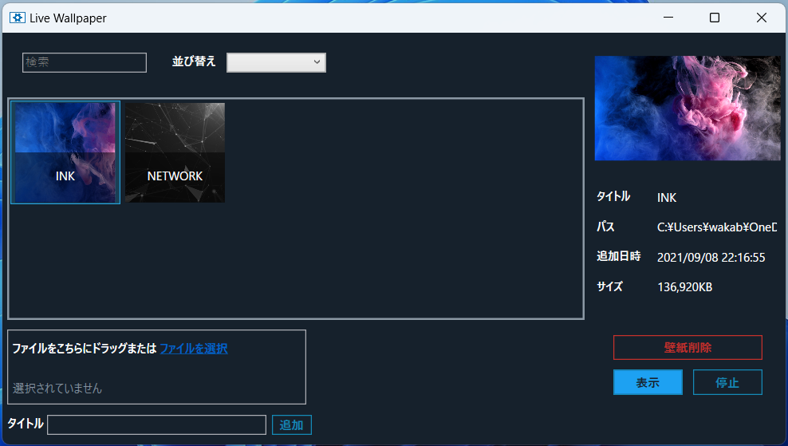

# Live Wallpapers
C#を用いて、ライブ壁紙を表示するデスクトップアプリを作成した。

## 構築環境
- 言語：C#
- フレームワーク：.NET Core 3.1

## システム要件
- OS:Windows10、Windows11
- メモリー：1024MB RAM

## Screenshots
### 機能
- <strong>ライブ壁紙表示</strong>
- <strong>動画ファイル追加</strong>
- <strong>プレビュー表示</strong>
- <strong>検索機能</strong>
- <strong>並び替え機能</strong>

   
### 表示する動画を選択し、右下の表示ボタンを押すと…
   
### ライブ壁紙が表示される
   
### 
   
